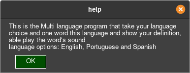

<h1 align="center">MultiLanguage Dictionary</h1>
<h2 align="center" >
    A simple GUI to search word's definition   
    
    
</h2>

# ⚈ About
This is the Multi language program that take your language choice and one word this language and show your definition. Language options: English, Portuguese and Spanish

## Some Screenshots

<h1 align="center">
  <h3>English search</h3>
   
  <h3>Portuguese search</h3>
   
  <h3>Spanish search</h3>
   
  <h3>Help</h3>
   
</h1>

# ⚈ Tech Stack

The following tools were used in the construction of the project:

- [Python](https://www.python.org/)
- [PySimpleGUI](https://pysimplegui.readthedocs.io/en/latest/cookbook/)
- [Selenium](https://selenium-python.readthedocs.io/)

<h1>⚈ Bugs and Features</h1>

Please report any type of bug. Remember that this is an open source project and will evolve with everyone's help. :) 
Any report will be read and will get due attention

 

New features are being done and new ideas are being created always that possible... 
new ideas will be accepted...

