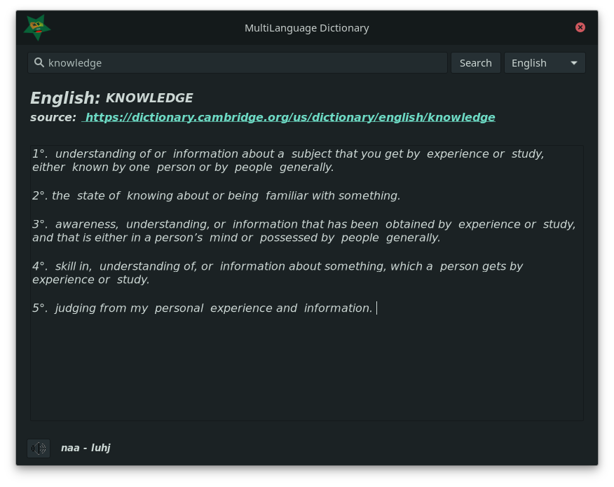
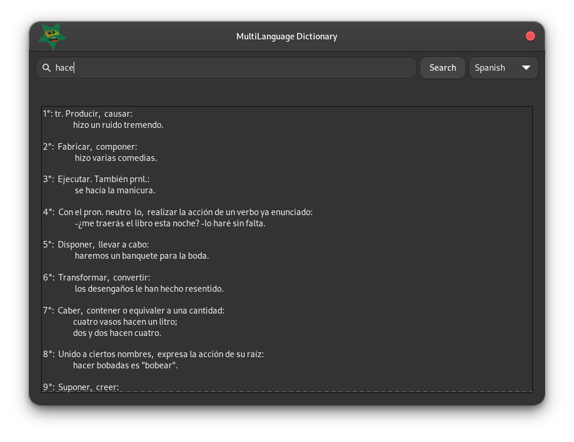

<h1 align="center">
  
</h1>
<h1 align="center">MultiLanguage Dictionary</h1>
<h2 align="center" >
Search for word definitions in a GTK application <br><br>
    
    
</h2>


# ⚈ About
This is a program that searches for word definitions on several languages, showing your definition, pronounce spell and playing an audio pronounce when available. 

language options: English, Portuguese and Spanish

# Requirements

Some python libs and software are required to run this program

### Python libs

```
pip3 install parsel requests_html 
```

### Ubuntu and/or Debian base
```
sudo apt install mpg123
```

### Fedora and/or Red Hat base
```
sudo dnf install mpg123
```

### Manjaro and/or arch base
```
sudo pamac install mpg123 
```


## Some Screenshots
<h1 align="center">
  <h3 align="center">English search</h3>
  <br>
  <h3 align="center">Portuguese search</h3>
  <br>
  <h3 align="center">Spanish search</h3>
  <br>
</h1>


# ⚈ Tech Stack

The following tools were used in the construction of the project:

- [Python](https://www.python.org/)
- [Gtk](https://www.gtk.org/)
- [Glade](https://glade.gnome.org/)
- [Parsel](https://pypi.org/project/parsel/)

<h1>⚈ Bugs and Features</h1>
<p>
Please report any type of bug. Remember that this is an open source project and will evolve with everyone's help. :)<br>
Any report will be read and will get due attention
</p><br>
<p>
New features are being done and new ideas are being created always that possible...<br>
new ideas will be accepted...
</p>
